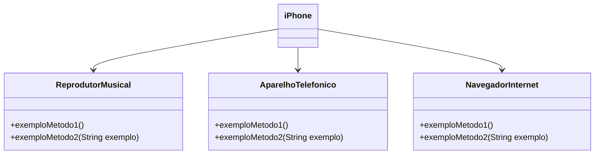

# IPhone--Projeto-do-Bootcamp-Santander---DIO---Curso-Backend-em-java
<div>
 
<h3>Modelagem e Diagramação de um Componente iPhone</h3>

<h5> O desafio original está abaixo, mas me propus a melhorar a complexidade visando um maior aprendizado desafiando meus limites. Tentarei as seguintes implementações, além das pedidas no desafio:

1 - Quando o usuário escolher o aplicativo "Navegador" no terminal, o terminal irá abrir realmente o aplicativo caso tenha ele no computador dele.

2 - Quando o usuário escolher o aplicativo "Spotify" no terminal, o terminal irá abrir o Spotify e não a mensagem : "Tocando música" como proposto pelo desafio original. 

3 - Quando o usuário escolher o aplicativo "YouTube" no terminal, o terminal irá abrir o "YouTube" ou "whatsapp", ou qualquer um dos aplicativos que tenha opção para o usuário. 

4 - Quando o usuário escolher o aplicativo "Telefone" no terminal, neste cenário seguirei o desafio original me mantendo ao basico, apenas incrementando algumas funções a mais, nada muito significativo. NO FIM MESMO DO TERMINAL, FAREMOS TUDO QUE O IPHONE FAZ ATRAVEZ DE OUTROS APLICATIVOS, COMO LIGAR PELO WHATSAPP.

5 - Por fim, acrescentei uma interface grafica simples, basta executar o IphoneGUI.java agora e clique na sua escolha...

<h3>Temos as seguintes classes para o nosso projeto de iPhone:</h3>

- App (classe abstrata)
- Spotify (subclasse de App)
- GoogleChrome (subclasse de App)
- Telefone (subclasse de App)
- Facebook (subclasse de App)
- WhatsApp (subclasse de App)
- YouTube (subclasse de App)
- Calendario (subclasse de App)
- Iphone (classe principal para interação com o usuário)

  
Menu do Iphone:
Escolha um aplicativo para abrir:
1. Spotify
2. Google Chrome
3. telefone
4. FaceBook
5. WhatsApp (onde também pode fazer ligações)
6. YouTube
7. Calendário
8. Sair
Digite o nº do app para abrí-lo:

</h5>
</div>


 
<p style="text-align: center; color:(255, 0, 0);">DESAFIO ORIGINAL.</p>


<div>
Neste desafio, você será responsável por modelar e diagramar a representação UML do componente iPhone, abrangendo suas funcionalidades como Reprodutor Musical, Aparelho Telefônico e Navegador na Internet.

#### Contexto
Com base no vídeo de lançamento do iPhone de 2007 (link abaixo), você deve elaborar a diagramação das classes e interfaces utilizando uma ferramenta UML de sua preferência. Em seguida, implemente as classes e interfaces no formato de arquivos `.java`.

[Lançamento iPhone 2007](https://www.youtube.com/watch?v=9ou608QQRq8)
- Minutos relevantes: 00:15 até 00:55

#### Funcionalidades a Modelar
1. **Reprodutor Musical**
   - Métodos: `tocar()`, `pausar()`, `selecionarMusica(String musica)`
2. **Aparelho Telefônico**
   - Métodos: `ligar(String numero)`, `atender()`, `iniciarCorreioVoz()`
3. **Navegador na Internet**
   - Métodos: `exibirPagina(String url)`, `adicionarNovaAba()`, `atualizarPagina()`

### Objetivo
1. Criar um diagrama UML que represente as funcionalidades descritas acima.
2. Implementar as classes e interfaces correspondentes em Java (Opcional).

### Exemplo de Diagrama UML (Mermaid)


### Instruções
1. Assista ao vídeo do lançamento do iPhone para entender as funcionalidades principais.
2. Utilize uma ferramenta UML de sua preferência para criar o diagrama das classes e interfaces. Você pode utilizar o modelo acima (criado na sintaxe [Mermaid](https://mermaid.js.org/)), uma alternativa open-source e compatível com arquivos Markdown como este.
3. Opcionalmente, caso esteja cheio(a) de confiança, pode implementar as classes Java representadas em seu diagrama UML.
4. Submeta seu repositório GitHub conforme as orientações da plataforma DIO. Por exemplo:

```bash
https://github.com/glysns/trilha-java-basico/desafios/poo/README.md
````
</div>
